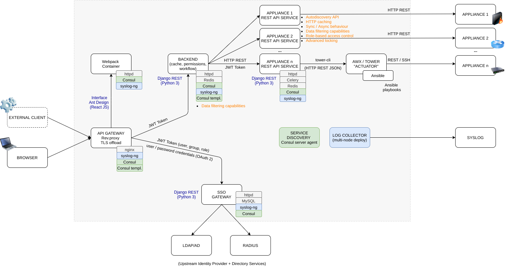

**AUTOMATION PLATFORM** 

The Automation Platfrom is designed to orchestrate on-premises IT infrastructures, allowing an enterprise to experience some of the advantages of the public Clouds, but with on-premises standard technologies.
The Automation Platfrom is GPL v3-licensed open source software.

**A QUICK TECHNICAL OVERVIEW**

The platform is composed by a modern Web interface which insists upon a microservices architecture. 

The whole platform itself exposes an API, so it can be consumed by a top-level orchestrator as well.
Each node of the architecture communicates with its upstream service by exposing an HTTP REST JSON API set; design is “API-first”, natively.

An API Gateway acts as the “entry point” of all the HTTP communications – it’s mainly a reverse proxy and TLS terminator.

The browser fetches the interface’s (static) files as a Webpack Container (from a httpd node), which insists upon a Browser Backend for any XHR HTTP call. The Browser Backend will consume APIs according to the client’s actions.

Any Appliance REST API service – for example the F5 node - is responsible for consuming the IT appliance/hypervisor APIs and manage it as needed.
As in any modern services-based architecture, any service node implements an autodiscoverable API set, HTTP caching capabilities (honours ETag, Last-Modified HTTP headers), role-based access control, locking and data filtering capabilities.

Services’ discovery is delegated to the well known Consul technology, so any node registers the offered services with the Consul server agent. Network topology is then shared amongst all nodes.

Any node runs a syslog-ng “agent”; the Log Collector service is usually connected to the corporate syslogger in order to record any user activity.

Being part of a microservice architecture, each node can be developed with any programming language. The the currently existing “inner” services are built using Python 3, running on a Linux box. The Web interface is built using React JS with the Ant Design user interface library.

***Authentication & Authorization schema***

Any consumer needs a JWT token in order to be authorized to communicate with any downstream producer service. 

The consumer obtains a JWT token from the Single Sign On Gateway service via its HTTP REST JSON API interface, providing a username / password. 

The JWT token embeds information regarding the user, their groups and roles. The JWT token is signed with a private RSA key and assigned a limited time-range validity.

User's information is fetched from the corporate's identity provider / directory services.

The SSO service supports the following identity providers: LDAP, Active Directory, Radius.

Any downstream service will validate the signed JWT token provided by the consumer: if it's still valid and if it's correctly signed - any service knows the public RSA key corresponding to the SSO's private. For a valid JWT token, the service will authenticate and authorize the consumer, basing on users/groups/roles information embedded within the JWT token.

***Deployment***

Given its target audience and usage, the Platform is designed to be deployed onto a single host, within containers (podman).
Each service node is running within a Podman container, which is internally organized exactly like a standard Linux distribution – processes are started as services and each service unit is started by Systemd. 

On the host, again, every container is launched and managed by a Systemd unit itself. 

Each node (container) is installed and managed on the system by using standard Linux packages: all is “Linux-best-practices compliant”.

**DEVELOPMENT**

Please see: https://github.com/LumIT-Automation/dev-setup

**PRE-BUILT (READY TO USE) PACKAGES**

The Automation platform can be installed via standard Linux packages (on a single host).
Debian 11 and CentOS 8 packages are available. Just install them as usual for your operating system of choice (apt install -y /path/to/packages/*.deb or  dnf install -y /path/to/packages/*.rpm respectively).

Some packages need an initial configuration in order to work.

**Debian** packages use debconf, so the setup is performed during installation.
The Single Sign On installer provides some basic debconf questions in order to configure the access to AD or Radius; however a manual review to the related config file in /var/lib/containers/storage/volumes/sso/_data/identityProvider/ is needed. Then restart the container service: 

systemctl restart automation-interface-sso-container.service.

For the API nodes:
 - Configure plugins' settings, if available and needed.

**CentOS** packages' installation need some trivial additional steps.
For the installation:
 - disable SELinux (only) during installation (setenforce 0)
 - enable epel repositories (dnf install -y epel-release) for syslog-ng
 - install packages

For the Single Sign On (aaa) node:
 - Set the local admin (admin@automation.local) password (on the HOST): /usr/bin/sso-reset-admin-password.sh <password> (for this release, avoid using spacial chars).
 - Configure the authentication backend. Currently, the supported authentication backends are: active directory, openldap and radius. The configuration files are contained in the /var/lib/containers/storage/volumes/sso/_data/identityProvider folder.
  
   - Active directory: configure the file ad_conf.py. There is a helper script which does some preliminary configuration: /usr/bin/ad_conf_generator.sh (on the HOST) for that.
        - Example: /usr/bin/ad_conf_generator.sh -i 10.0.111.110 -d lab.local -u adToken -p password -P -G groupRequired > /var/lib/containers/storage/volumes/sso/_data/identityProvider/ad_conf.py
Complete configuration must then be performed manually.
    - openldap: configure the file ldap_conf.py.
    - radius: configure the file radius_conf.py.

 - If needed, associate one or more AD groups to the superadmin user: set the SUPERADMIN_IDENTITY_AD_GROUPS list variable in /var/lib/containers/storage/volumes/sso/_data/settings.py with the DNs of these groups.

- systemctl restart automation-interface-sso-container.service
 
For the MTA service (smtp), configure the relay host:
 
    bash /var/smtp/usr/bin/postfix-setup.sh -f <FROM_EMAIL> -a <TO_EMAIL> -t authsmtp -r <RELAY_HOST> -n <ALLOWED_SUBNET> -u <RELAY_USERNAME>:<RELAY_PASSWORD>
 
For the API nodes:
 - Configure plugins' settings, if available and needed: edit the plugin config at /var/lib/containers/storage/volumes/CONTAINER_NAME/_data/plugins_conf/
 - Restart the service: systemctl restart automation-interface-CONTAINER_NAME-container.service

***Global proxy settings***

If an HTTP proxy is needed in order to connect to the Internet or to the devices, the easiest way is to set up the /etc/environment file in the HOST operating system and reboot (or export http_proxy and https_proxy variables) before install all the containers.

It's important to set up correctly the no_proxy variable, otherwise the containers will try to use the http proxy to connect between each others.  
   
/etc/environment:

    http_proxy=http://192.168.18.20:3128
    https_proxy=http://192.168.18.20:3128
    no_proxy="127.,192.168.18.,10.88.,localhost,.localdomain,.automation.local" # ATTENTION: this does not work with curl: use http_proxy=... https_proxy=... curl ... when needed
    
    # It's also possible to obtain a curl compatible no_proxy configuration specifying each single ip address to exclude: 
    no_proxy="127.0.0.1,"`echo 192.168.18.{1..255},``echo 10.88.0.{1..255},`"localhost,.localdomain,.automation.local" # this works also with curl.

***First run***
 
Once all nodes are created and running,
- browse to the IP address of the machine in which you have installed the packages to load the web GUI (it's located at the reverse proxy entry point URL);
- use the superadmin login, admin@automation.local with the password you have set up;
- via the GUI you can: 
    - connect the platform to the appliances' assets (save their login information and check that the platform is able to fetch data with the superadmin user), 
    - create the RBAC permissions on the assets: grant permissions to the authentication groups (the model is role to group on appliance's asset/"container", where a role is a collection of privileges). 
- All these actions can be of course directly performed via the api-* nodes' API (first get a JWT tokwn from the Single Sign On node).
